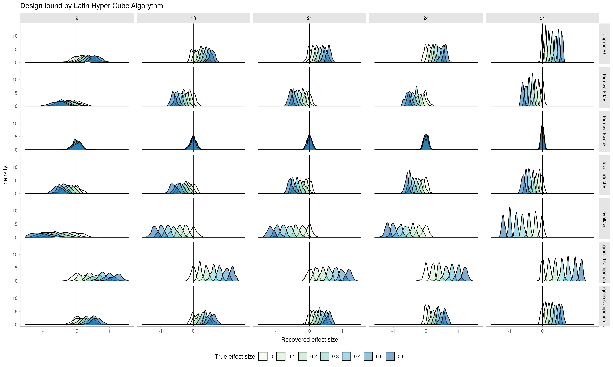
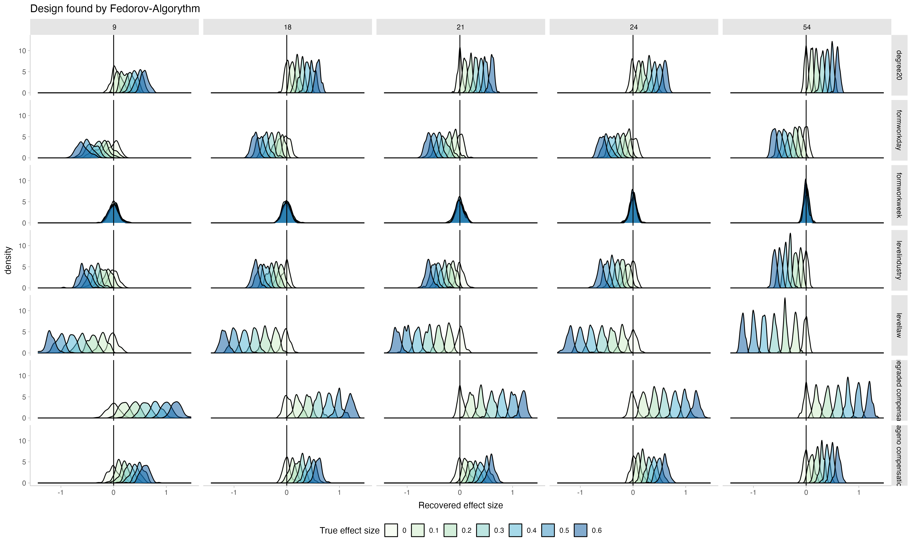

# The Problem

Vigniette-studies are a nice way to elicit evaluations from participants about a natural-sounding case that still allows researchers to make solid statistical analyses by systematically varying the content of the vigniettes. 

However, giving participants many vigniettes is tiring for them, which might diminish data quality because they stop reading the vigniettes carefully. A solution is to present participants with only a few vigniettes each and get enough participants. 

But how many vigniette-sets should we prepare? And which combinations of vigniette-features make for an optimal design? 

# Optimal Designs

In this script, I compare two approaches: The Fedorov-Algorythm, which opimises the design of the vigniettes for fitting a particular model, and the Latin-Hyper-Cube, an extention of the Latin Square, that gives random samples from the entire vigniette universe such that the samples are distributed evenly. 

To test how each algorythm performs, I use the identified optimal design and simulate data from it. Then I try to recover the parameters in the simulated data. The more optimal the design is for statistical inference, the better these parameters are recovered. Also, this can inform about power to detect specific effect sizes.

Each block of code follows the same logic: 

- preparing the data structures
- loop through different possible number-of-vigniettes
  - create the optimal design for this number of vigniettes
- loop through different effect sizes to be recovered
- loop through iterations
  - simulate the data
  - run frequentist hierarchical regression to recover the effect (bayesian here would be even nicer but would take forever)


## Data story

Reducing working time is a recurrent topic in Post-Growth and Sustainability Literature, and, historically, a trend (200 years ago, working time was much longer). Workingtime reductions can be achieved in practice in different ways. For example, the level of introduction matters reducing time could be mandatory by law, introduced by a sector of the economy, or on the level of individual firm. In addition, the degree of the reduction can change, whether or not employees receive full or no monetary compensation, or whether higher wage-classes receive no compensation but lower wage-classes do (i.e. whether or not a reduction leads to a wage-reduction), and whether employees receive the reduction by reduced work-days, shorter weeks (exp. one afternoon off), or more vacations. We want to design a vigniette study that answers the question: "Which combination of these properties of a possible working-time reduction implementation is received most favorably? 

Thus, we need to find a design of vigniettes from a combination of `3 x 2 x 3 x 3`  = `r 3*2*3*3` possible vigniettes. For both methods to find the optimal design, the user has to specify the total number of distinct vigniettes that are needed. I will also loop over these. In addition, the data simulation will be such that each participant sees only 3 vigniettes, there is variance between participants and between vigniettes (random-intercepts), and measurement-noise. These are realistic constraints and should be included in the data simulation for the parameter recovery.

In the experiment, participants get, in the end, three scenarios and indicate how much they would be in favour of a working-time reduction in the proposed fashion, e.g.: "How desirable would you find a workingtime-reduction, if it was introduced by the corresponding industry (level), if it meant that employees need to work 20% less (degree), there is no wage compensation (compensation) so that everyone earned less, and if the reduction were realized the form of more vacations (form)?". 

For the data simulation, to not make things more complicated, we simulate participants' latend agreement on an arbitrary scale. To simulate actual Lickert-Scale-Answers, one would simply have to introduce thresholds within that scale, above which participants' answers would change to the next-higher answer category. 

```{r}
# setup
library(AlgDesign)
library(tidyverse)
library(faux)
library(brms)
library(tidybayes)
library(lhs)  
library(cluster)
library(seriation)


set.seed(123) # For reproducibility
my_cache = T

knitr::opts_chunk$set(fig.pos = 'H',
                      cache = my_cache,
                      cache.path = "chache/",
                      dpi = 600,
                      fig.path = "figs/",
                      fig.align = "center", 
                      fig.asp = 0.62) # goldener Schnitt für Plots => ist schöner
```

## Setting up the data
```{r}
#constants
## Define the factors that will change in the vigniettes and their levels
factors <- list(
  level = c("firm", "industry", "law"),
  degree = c("10", "20"),
  wage = c("no compensation", "full compensation", "graded compensation"),
  form = c("workday", "workweek", "vacation")
)


factor_levels <- map_int(factors, ~ length(.x)) # to get the length of the factors

model_formula_fed <- ~ level + degree + wage + form # argumnet needed for the Fedorov Algorythm, not the formula to generate data


## constants for data simulation
n_participants <- 300 # how many people will be recruited?
n_trials_per_participant <- 3 # not all trials will be seen by all participants, too tiring => they don't pay attention to the details anymore
grand_intercept <- 0
participant_random_intercept <- 0.5 # standard-deviation of the random effects, i.e. random differences between participants
vigniette_random_intercept <- 0.1 # again in standard deviations
measurment_error <- 0.1 # again in standard deviations
n_lines_data <- n_participants * n_trials_per_participant # size of final file of simulated data

## constants of simulation
repeats <- 100 # how many time will the data simulation be repeated?
```


# Order of vignietts
Since we assume that not all participants will look at all vigniettes (too tiering), we have a second challange: not only need the identified combinations of vigniette properties be an optimal design for inference, they also need to lead to participants getting maximally distinct vigniettes. This helps inference and is nicer for participants. Hence, The following function takes the design generated by the respective algorythm and sorts the lines such that each line is maximally different from the previous one. Then, packages of `n_trials_per_participant` = `r n_trials_per_participant` can be made and delivered to participants. 

```{r, eval = F}
# function to calculate the distance of rows:

maximally_dissimilar_order <- function(df) {
  # Compute Gower distance matrix between all lines
  dist_matrix <- as.matrix(daisy(df, metric = "gower"))
  n <- nrow(df)

  # Initialize a tibble to track selected indices and usage
  indices_tibble <- tibble(
    index = 1:n,
    used = FALSE,
    order = NA_integer_
  )

  # Start with a random row
  starting_row <- sample(indices_tibble$index, 1)
  
  indices_tibble <- indices_tibble |> 
    mutate(
      order = if_else(index == starting_row, 1, NA_integer_)
    )  |> 
    mutate(
      used = if_else(index == starting_row, TRUE, FALSE)
    )

  # Iteratively select the most dissimilar row
  for (i in 2:n) {
    last_index <- indices_tibble |> 
      filter(!is.na(order))  |>  
      pull(index)  |>  
      last()
    # get the distances to the last selected row, for unused rows
    distances <- dist_matrix[last_index, indices_tibble$index[!indices_tibble$used]]
    # Find the index of the maximum distance
    maximum_distance_index <- indices_tibble$index[!indices_tibble$used][which.max(distances)]
    # Update the order and mark as used
    indices_tibble <- indices_tibble %>%
      mutate(
        order = if_else(index == maximum_distance_index, i, order),
        used = if_else(index == maximum_distance_index, TRUE, used)
      )
  }

  # Return the data frame in the new order
  df[indices_tibble$order, ]
}
```


# Parameter recovery latin hyper cube

```{r eval = F}

# prepare output-datq of loop
power_lhc <- tibble(
  n_vigniettes = numeric(),
  effect_size = numeric(), 
  n_repeat = numeric(),
  term = character(), 
  estimate = numeric()
)

vigniette_combos_lhc_power <- tibble(
  n_vigniettes = numeric(), 
  level = character(), 
  degree = character(),  
  wage = character(), 
  form = character()
)


# loop over different decisions as to "how many distinct vigniettes should be generated?"
for (curr_n_vign in c(9, 18, 21, 24, 54)) {
  
  print(paste0("starting with n_vign ", as.character(curr_n_vign)))
  
  ## 1) find the optimal design for a given number of vigniettes
  # find optimal combinations with Latin hyper cube
  lhs_design <- randomLHS(n = curr_n_vign, k = length(factors))
  
  # Rescale LHS to the factor levels
  lhs_scaled <- sweep(lhs_design, 2, factor_levels, "*")
  
  # Create the design matrix by mapping LHS indices to the factors
  optimal_design <- data.frame(
    level = factors$level[ceiling(lhs_scaled[, 1])],
    degree = factors$degree[ceiling(lhs_scaled[, 2])],
    wage = factors$wage[ceiling(lhs_scaled[, 3])],
    form = factors$form[ceiling(lhs_scaled[, 4])]
  ) 
  optimal_design[] <- lapply(optimal_design, as.factor) 
  
  ## 2) set of combinations that are maximally different
  
  # get a maximally different set of combinations of vigniettes following each other
  # bc we will make packs of 3 and then, the 3 vigniettes that each person seas should be 
  # as different as possible

  optimal_order_combos <- maximally_dissimilar_order(optimal_design) |> 
      mutate(n_vigniettes = curr_n_vign)
  
  # prepare data file for data simulation
  vigniette_combos_lhc_power <- vigniette_combos_lhc_power |>
    bind_rows(optimal_order_combos)
    
  ## looping through different effect sizes
  for (curr_eff_size in seq(0, 0.6, 0.1)) {
    
    print(paste0("starting with effect size ", as.character(curr_eff_size)))
    
    ## for each effect size, we will simulate nrepeats of new data sets and try to recover the parameters from curr_eff_size    
    for (curr_repeat in 1:repeats) {
      
        ## 1) simulate data
        # not all n_vign can be fully repeated within 900 trials => prepare the repetition-number
        theoretical_repeats <- n_participants*n_trials_per_participant/curr_n_vign
        n_entries <- if (omnibus::is.wholeNumber(theoretical_repeats)) {
          theoretical_repeats
        } else {
          ceiling(theoretical_repeats)
        }

        # make the data
        simulated_data <- data.frame(
          participant_id = rep(1:n_participants, each = n_trials_per_participant),
          level = rep(optimal_order_combos$level, times = n_entries)[1:n_lines_data],
          degree = rep(optimal_order_combos$degree, times = n_entries)[1:n_lines_data],
          wage = rep(optimal_order_combos$wage, times = n_entries)[1:n_lines_data],
          form = rep(optimal_order_combos$form, times = n_entries)[1:n_lines_data])|> 
          mutate_at(.vars = 2:5, ~ as.character(.)) |> 
          unite(col = "vigniette_id", 2:5, remove = F) |> 
          add_ranef(.by = "participant_id", part_rand_intercept = participant_random_intercept) |> 
          add_ranef(.by = "vigniette_id", vign_rand_intercept = vigniette_random_intercept) |> 
          mutate(measurement_error = rnorm(n= n_lines_data, mean = 0, sd = measurment_error), 
                 effect_level = case_when(level == "firm" ~ curr_eff_size, 
                                          level == "industry" ~ 0, 
                                          level == "law" ~ - curr_eff_size) , 
                 effect_degree = case_when(degree == "10" ~ 0, 
                                            degree == "20" ~ curr_eff_size), 
                 effect_wage = case_when(wage == "no compensation" ~ 0, 
                                         wage == "full compensation" ~ -curr_eff_size, 
                                         wage == "graded compensation" ~ curr_eff_size), 
                 effect_form = case_when(form == "workday" ~ 0, 
                                         form == "workweek" ~ curr_eff_size, 
                                         form == "vacation" ~ curr_eff_size),
                 latent_answer = grand_intercept + 
                                  effect_level + effect_degree + effect_wage + effect_form + # main effects
                                 part_rand_intercept + vign_rand_intercept + measurement_error ) # variance 
         
        
        ## 3) recover parameters
        
        ## frequentist way
          freq <- lme4::lmer(latent_answer ~  level + degree + wage  + form + (1 |participant_id) + (1|vigniette_id), simulated_data) |> broom.mixed::tidy() |> 
            select(term, estimate, std.error) 
          
          out_freq <- freq[2:8, 1:3] |> 
            mutate(n_vigniettes = curr_n_vign, 
                   effect_size = curr_eff_size, 
                   n_repeat = curr_repeat)
          
          power_lhc <- power_lhc |> bind_rows(out_freq)
          
    }   
  }
}

  
plot_lhc <- power_lhc |> 
  filter(term != "sd__(Intercept)") |> 
  ggplot(aes(x = estimate, fill = as.factor(effect_size))) + 
  geom_density(alpha = 0.5)+
  facet_grid(term ~ as.factor(n_vigniettes) ) + 
  geom_vline(xintercept = 0) + 
  ggtitle("Design found by Latin Hyper Cube Algorythm") + 
  labs(fill = "True effect size", 
       x = "Recovered effect size") + 
  scale_fill_brewer(palette = "GnBu") + 
  theme_tidybayes() + 
  theme(legend.position = "bottom")


```


The data is simulated on the underlying latent scale of agreement of participants with worktime-reductions in a particular setup. The plot shows how the true effect size that was underlying the generating data, is recovered.




Notice that as more vignietts out of the entire possible vigniette-universe are chosen (9 - the full set of 54), the distributions of the recovered parameters become more narrow: recovery gets better. Notice also how, as the true effect size becomes smaller, the distributions approach zero, showing that the recovery is sensitive to changes in effect size. 

From this, I would choose to select 24 vigniettes and give packages of 3 to each participant: the recovery is almost as good as with the full set, while having fewer number of distinct vigniettes is less risky if I can't manage to recruit as many participants as I wanted, because I will still have enough repetitions per vigniette. In contrast, choosing to use all 54 possible vignietts with a small sample might lead to unlucky combinations of missings and poorer inference. 

Next, let's see how the Fedorov algorythm performs.

# Parameter recoversy of design with fedorov


```{r eval = F}

# prepare output loop
power_fedorov <- tibble(
  n_vigniettes = numeric(),
  effect_size = numeric(), 
  n_repeat = numeric(),
  term = character(), 
  estimate = numeric()
)


vigniette_combos_fedorov_power <- tibble(
  n_vigniettes = numeric(), 
  level = character(), 
  degree = character(),  
  wage = character(), 
  form = character()
)


for (curr_n_vign in c(9, 18, 21, 24, 54)) {
  
  print(paste0("starting with n_vign ", as.character(curr_n_vign)))
  
    
  full_design <- expand.grid(factors)
    
    # Use optFederov to generate the design matrix
    optimal_design <- optFederov(model_formula_fed, 
                                 full_design, 
                                 nTrials = curr_n_vign,  # confusingly, this is the n(vingiettes) to be created, not n-vigniettes per person
                                 nRepeats = 100) 
    optimal_combinations <- optimal_design$design 
    
   
      
  
  # get a maximally different set of combinations of vigniettes following each other
  # bc we will make packs of 3 and then, the 3 vigniettes that each person seas should be 
  # as different as possible

  optimal_order_combos <- maximally_dissimilar_order(optimal_combinations)|>
      mutate(n_vigniettes = curr_n_vign)
  
   # save the vigniettes
  vigniette_combos_fedorov_power <- vigniette_combos_fedorov_power |> bind_rows(optimal_order_combos) 


  for (curr_eff_size in seq(0, 0.6, 0.1)) {
    
    print(paste0("starting with effect size ", as.character(curr_eff_size)))
        
    for (curr_repeat in 1:repeats) {
      
      
      
        ## simulate data
        # not all n_vign can be fully repeated within 900 trials => prepare the repetition
        theoretical_repeats <- n_participants*n_trials_per_participant/curr_n_vign
        n_entries <- if (omnibus::is.wholeNumber(theoretical_repeats)) {
          theoretical_repeats
        } else {
          ceiling(theoretical_repeats)
        }

        # make the data
        simulated_data <- data.frame(
          participant_id = rep(1:n_participants, each = n_trials_per_participant),
          level = rep(optimal_order_combos$level, times = n_entries)[1:n_lines_data],
          degree = rep(optimal_order_combos$degree, times = n_entries)[1:n_lines_data],
          wage = rep(optimal_order_combos$wage, times = n_entries)[1:n_lines_data],
          form = rep(optimal_order_combos$form, times = n_entries)[1:n_lines_data])|> 
          mutate_at(.vars = 2:5, ~ as.character(.)) |> 
          unite(col = "vigniette_id", 2:5, remove = F) |> 
          add_ranef(.by = "participant_id", part_rand_intercept = participant_random_intercept) |> 
          add_ranef(.by = "vigniette_id", vign_rand_intercept = vigniette_random_intercept) |> 
          mutate(measurement_error = rnorm(n= n_lines_data, mean = 0, sd = measurment_error), 
                 effect_level = case_when(level == "firm" ~ curr_eff_size, 
                                          level == "industry" ~ 0, 
                                          level == "law" ~ - curr_eff_size) , 
                 effect_degree = case_when(degree == "10" ~ 0, 
                                            degree == "20" ~ curr_eff_size), 
                 effect_wage = case_when(wage == "no compensation" ~ 0, 
                                         wage == "full compensation" ~ -curr_eff_size, 
                                         wage == "graded compensation" ~ curr_eff_size), 
                 effect_form = case_when(form == "workday" ~ 0, 
                                         form == "workweek" ~ curr_eff_size, 
                                         form == "vacation" ~ curr_eff_size),
                 latent_answer = grand_intercept + 
                                  effect_level + effect_degree + effect_wage + effect_form + # main effects
                                 part_rand_intercept + vign_rand_intercept + measurement_error ) # variance 
         
        
        # recover parameters
        
        ## frequentist way
          freq <- lme4::lmer(latent_answer ~  level + degree + wage  + form + (1 |participant_id) + (1|vigniette_id), simulated_data) |> broom.mixed::tidy() |> 
            select(term, estimate, std.error) 
          
          out_freq <- freq[2:8, 1:3] |> 
            mutate(n_vigniettes = curr_n_vign, 
                   effect_size = curr_eff_size, 
                   n_repeat = curr_repeat)
          
          power_fedorov <- power_fedorov |> bind_rows(out_freq)
          
    }   
  }
}

  
plot_fed <- power_fedorov |> 
  filter(term != "sd__(Intercept)") |> 
  ggplot(aes(x = estimate, fill = as.factor(effect_size))) + 
  geom_density(alpha = 0.5)+
  facet_grid(term ~ as.factor(n_vigniettes) ) + 
  geom_vline(xintercept = 0) + 
  ggtitle("Design found by Fedorov-Algorythm") + 
  labs(fill = "True effect size", 
       x = "Recovered effect size")+ 
  scale_fill_brewer(palette = "GnBu") + 
  theme_tidybayes()


```

Let's look at the performance: 



The general pattern is very similar, but the main difference is that when choosing few vigniettes from the universe (e.g. 9 or 18 out of 54 possible ones), the parameters recovered by the Latin Hyper Cube were more spread out whearas here, the distributions of recovered parameters are more narrow, indicating a better recovery
